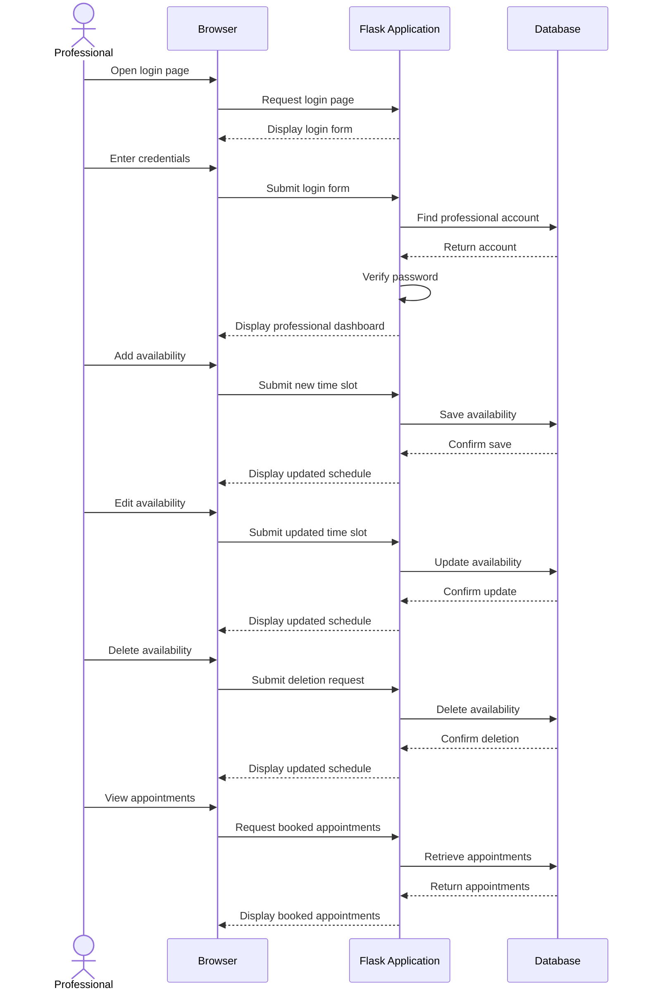

```mermaid
sequenceDiagram
    actor Professional
    participant Browser
    participant App as Flask Application
    participant DB as Database

    Professional->>Browser: Open login page
    Browser->>App: Request login page
    App-->>Browser: Display login form

    Professional->>Browser: Enter credentials
    Browser->>App: Submit login form
    App->>DB: Find professional account
    DB-->>App: Return account
    App->>App: Verify password
    App-->>Browser: Display professional dashboard

    Professional->>Browser: Add availability
    Browser->>App: Submit new time slot
    App->>DB: Save availability
    DB-->>App: Confirm save
    App-->>Browser: Display updated schedule

    Professional->>Browser: Edit availability
    Browser->>App: Submit updated time slot
    App->>DB: Update availability
    DB-->>App: Confirm update
    App-->>Browser: Display updated schedule

    Professional->>Browser: Delete availability
    Browser->>App: Submit deletion request
    App->>DB: Delete availability
    DB-->>App: Confirm deletion
    App-->>Browser: Display updated schedule

    Professional->>Browser: View appointments
    Browser->>App: Request booked appointments
    App->>DB: Retrieve appointments
    DB-->>App: Return appointments
    App-->>Browser: Display booked appointments
```
