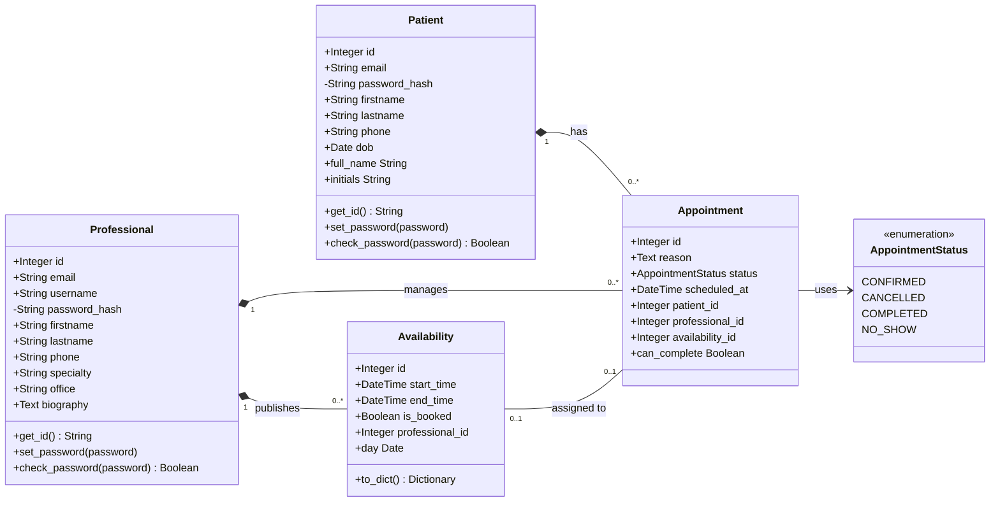

# CareSchedule UML Class Diagram

```mermaid
classDiagram
direction LR

class Patient {
    +Integer id
    +String email
    -String password_hash
    +String firstname
    +String lastname
    +String phone
    +Date dob
    +full_name String
    +initials String
    +get_id() String
    +set_password(password)
    +check_password(password) Boolean
}

class Professional {
    +Integer id
    +String email
    +String username
    -String password_hash
    +String firstname
    +String lastname
    +String phone
    +String specialty
    +String office
    +Text biography
    +get_id() String
    +set_password(password)
    +check_password(password) Boolean
}

class Availability {
    +Integer id
    +DateTime start_time
    +DateTime end_time
    +Boolean is_booked
    +Integer professional_id
    +day Date
    +to_dict() Dictionary
}

class Appointment {
    +Integer id
    +Text reason
    +AppointmentStatus status
    +DateTime scheduled_at
    +Integer patient_id
    +Integer professional_id
    +Integer availability_id
    +can_complete Boolean
}

class AppointmentStatus {
    <<enumeration>>
    CONFIRMED
    CANCELLED
    COMPLETED
    NO_SHOW
}

Patient "1" *-- "0..*" Appointment : has
Professional "1" *-- "0..*" Appointment : manages
Professional "1" *-- "0..*" Availability : publishes
Availability "0..1" -- "0..1" Appointment : assigned to
Appointment --> AppointmentStatus : uses
```
